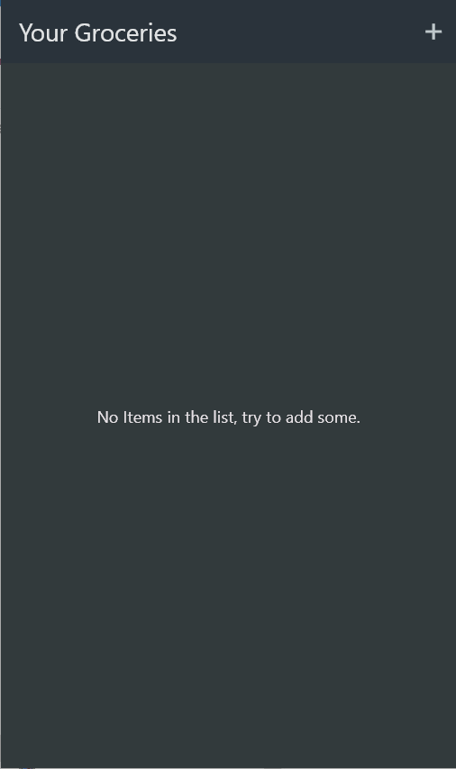
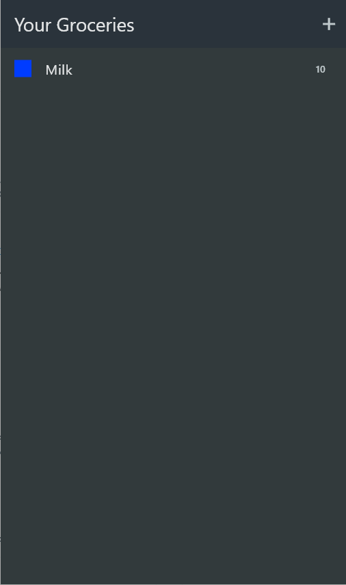
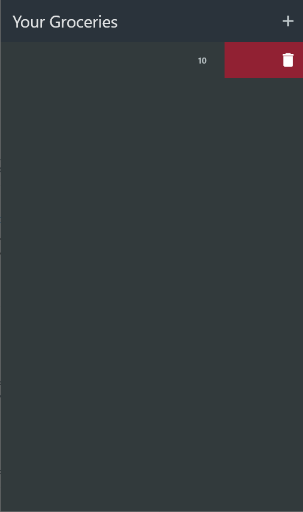
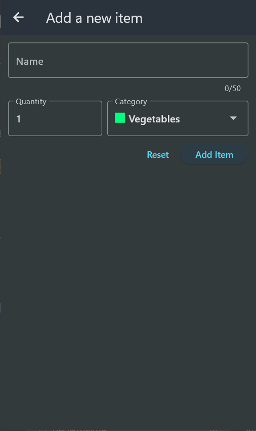
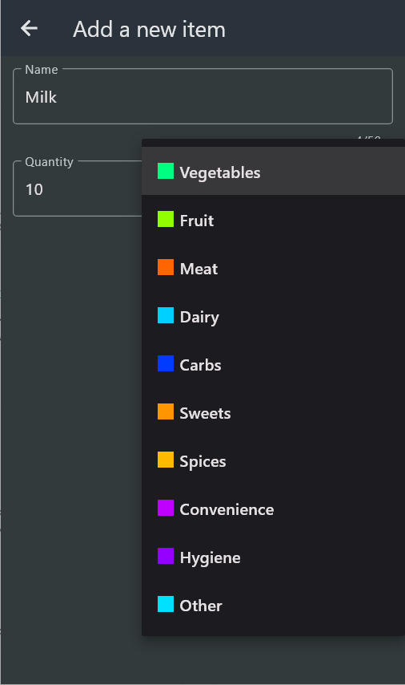
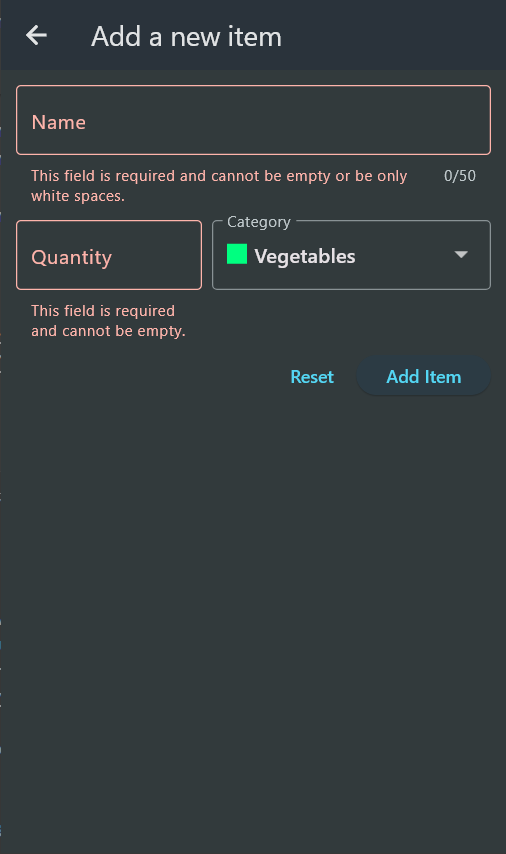
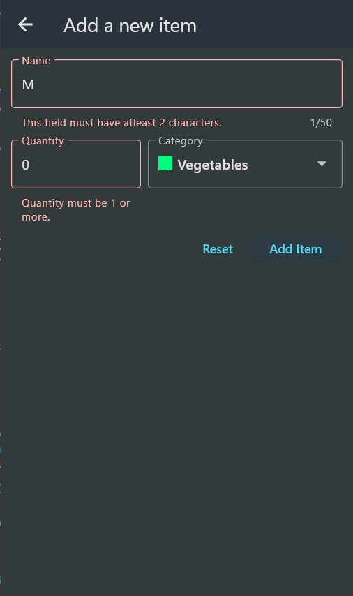

# Grocery List Flutter App

## Overview

The Grocery List Flutter App allows users to manage their grocery items conveniently. Users can add, view, and manage their grocery list through a simple and intuitive interface.

## Features

### Grocery List Management

- **View Groceries**: Display the list of grocery items.
  - If no items are in the list, a message prompts the user to add new items.
  - Items in the list are dismissable, allowing users to remove items by swiping them away.

### Adding a New Item

- **Add Item Form**: A form to add a new grocery item with the following fields:
  - **Name**: Name of the item (required, cannot be empty or contain only white spaces).
  - **Category**: Category of the item (e.g., Vegetables).
  - **Quantity**: Quantity of the item.

- **Form Buttons**:
  - **Reset**: Clears the form fields.
  - **Add Item**: Submits the form to add the item to the list.

## User Interface

### Main Screen

- Displays the list of groceries.
- Shows a message if the list is empty, prompting the user to add new items.
- Allows dismissing items by swiping them away.

### Add Item Screen

- Contains a form with fields for name, category, and quantity.
- Displays validation messages for required fields.
- Includes buttons to reset the form and add the item to the list.

## Validation

- The app ensures that the name field is not empty and does not contain only white spaces.
- Category and quantity fields are also required for adding a new item.

## How to Use

1. **View Groceries**:
   - Open the app to see the list of current grocery items.
   - If the list is empty, follow the prompts to add new items.
   - Swipe an item to dismiss it from the list.

2. **Add a New Item**:
   - Click on the "Add New Item" button.
   - Fill in the form with the item's name, category, and quantity.
   - Click "Add Item" to save the item to the list.
   - Use the "Reset" button to clear the form if needed.

## Screenshots

### Main Screen

*Main Screen when no items are present.*

*Main Screen displaying one grocery item.*

*Main Screen showing the dismiss action.*

### Add Item Screen

*Form for adding a new item.*

*Dropdown menu for selecting the category.*

*Validation message for the name field.*

*Validation message for the quantity field.*

## Video Demo

## License

This project is licensed under the MIT License - see the [LICENSE](LICENSE) file for details.

## Conclusion

The Grocery List Flutter App is a practical tool for managing grocery shopping. It features an easy-to-use interface and ensures users can quickly add and manage their grocery items.
